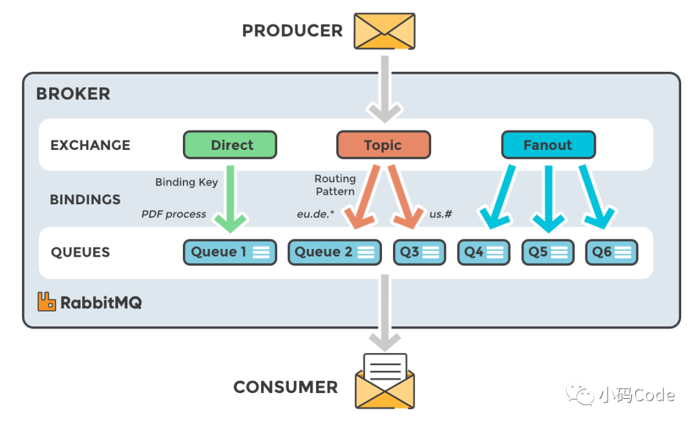

# RabbitMQ

## windows环境构建

1. erlang环境安装
    - 官网下载安装 http://www.erlang.org/downloads/
    - 环境变量配置(配置到安装目录下bin层即可)
    - cmd执行erl  显示实例：Eshell *V13.2* 即配置成功
    - 因为RabbitMQ是基于Erlang语言开发的所以需要构建erlang环境
2. rabbitmq安装 *V3.11.10*
    - 官网下载安装 https://www.rabbitmq.com/download.html
    - 打开任务管理器，停止rabbitmq服务
    - cmd进入sbin目录下，执行rabbitmq-plugins enable rabbitmq_management
   命令安装插件
    - 将服务重新启动
    - 浏览器访问http://127.0.0.1:15672/  默认用户名密码 guest
    - 这时候就能可视化查看rabbitmq运行情况了
    

## SpringBoot集成RabbitMQ

1. 添加依赖
```
<dependency>
    <groupId>org.springframework.boot</groupId>
    <artifactId>spring-boot-starter-amqp</artifactId>
</dependency>
```

2. 添加配置

```
# RabbitMQ服务的地址
spring.rabbitmq.host=localhost
spring.rabbitmq.port=5672
spring.rabbitmq.username=guest
spring.rabbitmq.password=guest
# RabbitMQ 服务创建的虚拟主机(非必须)
spring.rabbitmq.virtual-host=/
```

3. 创建生产者
```java
import org.springframework.amqp.rabbit.core.RabbitTemplate;
import org.springframework.beans.factory.annotation.Autowired;
import org.springframework.stereotype.Component;

@Component
public class Producer {

    @Autowired
    private RabbitTemplate rabbitTemplate;

    public void produce() {
        String message = "疫情期间注意防护";
        System.out.println("乡长说：" + message);
        rabbitTemplate.convertAndSend("notice_queue", message);
    }
}
```
4. 创建消费者
```java
import org.springframework.amqp.rabbit.annotation.Queue;
import org.springframework.amqp.rabbit.annotation.RabbitHandler;
import org.springframework.amqp.rabbit.annotation.RabbitListener;
import org.springframework.stereotype.Component;

@Component
public class Consumer {

    @RabbitHandler
    @RabbitListener(queuesToDeclare = @Queue("notice_queue"))
    public void process(String message) {
        System.out.println("村里猿公子收到通知：" + message);
    }
}
```

4. 工作模式详解
   - 简单模式
    ```
      生产者和消费者 一一对应，发送消息时只需要指定队列名称即可，不需要再指定交换机
    ```
   - 工作模式
    ```
      1个生产者多个消费者，类似负载均衡的概念，消费者轮流消费
    ```   
   - 发布订阅模式
    ```
      一次向多个消费者发送消息，redis也有该模式，可查看config下PublishConfig配置
      创建Fanout交换机，也就是扇形交换机，然后将队列直接绑定到交换机上
      生产消息时，只需要指定交换机即可，交换机会将消息分发到所有与它绑定的队列中，类似广播概念
    ```
   - 路由模式
    ```
      创建Direct交换机，也就是直连交换机，将队列绑定到交换机上，并且指定该队列匹配的路由键
      生产消息需要指定路由，交换机通过routingKey匹配分发到对应队列上
      消息指定的路由与交换机上绑定的路由需要完全匹配，否则消息无法发送到指定队列中
    ```
   - 主题模式
    ```
      创建Topic交换机，也就是主题交换机，将队列绑定到交换机上，并且指定该队列匹配的路由键及通配符
      生产的消息需要指定固routingKey,例如.com结尾、www.开头消息
      交换机会根据绑定路由键通配符进行判断是否匹配，注意 * 只匹配单个 # 可匹配多个
      主题模式与路由模式相似，路由模式是特定配置绑定唯一队列，而主题模式可以通过通配符进行模糊匹配
    ```
    ```
      主题模式路由匹配规则解析 
      #.com表示接收多个以.com结尾的字段。
      例如：taobao.com、www.taobao.com、www.jd.com。
      *.com表示接收一个以.com结尾的字段。
      例如：taobao.com、jd.com。
      多个字段是无法匹配的，比如www.taobao.com、cn.taobao.com。
      www.#可以匹配多个以www开头的字段。
      例如www.taobao.com、www.jd。
      www.*可以匹配一个以www开头的字段。
      例如：www.taobao、www.jd。
      多个字段是无法匹配的,比如www.taobao.com、www.jd.com。
    ```
   - RPC模式
    ```
     可获取消费者返回值，具体的将生产消息的方法替换为convertSendAndReceive即可获取响应
    ```
5. 交换器解析
      - 交换器类型 
      >（1）直连交换机 Direct <br>
       （2）扇形交换机 Fanout <br>
       （3）主题交换器 Topic
      - 交换器图解
      
    